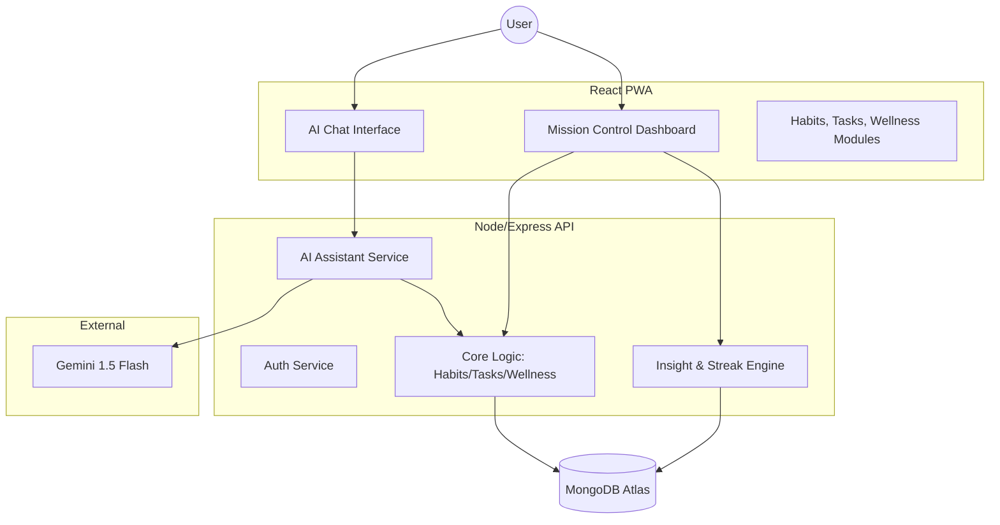

# System Architecture
## Unified Daily Tracker (Life-OS) — MERN v2

> **Version:** 2.0 | **Last updated:** March 2026

## Architecture Pattern

Modular MERN architecture with an integrated **AI Intelligence Layer**. Designed for rapid logging and holistic data processing.

## Core Components

### Frontend (React)
- **Unified Dashboard:** Time-phased view (Morning/Noon/Night) showing habits, tasks, and wellness status.
- **AI Chat Interface:** Floating or dedicated entry point for natural language logging.
- **Module Views:** Dedicated CRUD and detail screens for Habits, Tasks, and Wellness logs.
- **Insight Center:** Data visualizations and AI-generated correlation cards.

### Backend (Node/Express)
- **AI Gateway:** Handles prompt engineering, LLM communication, and function calling (tool use) to update database modules.
- **Productivity Engine:** Managed task lifecycle (Pending -> Completed) and auto-carryover logic.
- **Wellness Service:** Validates and stores biometric and mood data.
- **Insight Engine:** Background or on-demand processing to find correlations between wellness and productivity/habits.

### Database (MongoDB)
- **Users, Habits, Habit Check-ins.**
- **Tasks:** To-do items with status and carryover metadata.
- **Wellness Logs:** Mood, energy, water, and reflection entries.
- **AI Interactions:** History of chat logs and parsed actions.

## Data Flow (AI Logging Example)
1. User types: "Drank 500ml water and finished the sales report."
2. **AI Gateway** sends prompt + tools to **Gemini**.
3. Gemini returns `{ action: "LOG_WELLNESS", data: { water: 0.5 }, action: "COMPLETE_TASK", data: { title: "sales report" } }`.
4. **AI Gateway** executes these updates via the **Core Logic**.
5. **MongoDB** persists the changes.
6. **Frontend** receives a real-time update (via TanStack Query) and refreshes the Dashboard.

## Security & Reliability
- **Privacy:** Encrypted data at rest and in transit. AI prompts stripped of PII where possible.
- **Resilience:** Circuit breakers for LLM requests; fallback to manual dashboard entry.
- **Scale:** Optimized for 1,000+ MAU with index-heavy MongoDB queries.

## API Style
- RESTful JSON API with `/api/v2` prefix.
- Consistent Error Envelope and HTTP status codes.
- Rate limiting specifically tuned for AI and Auth endpoints.
